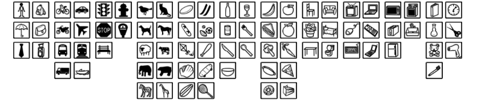
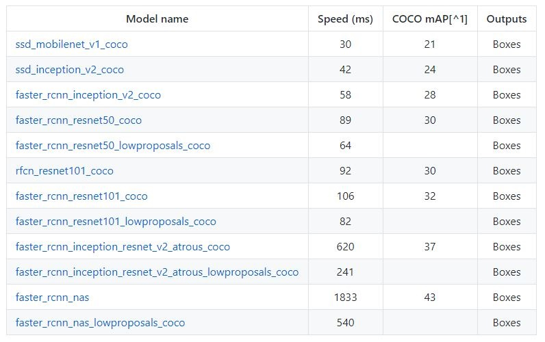
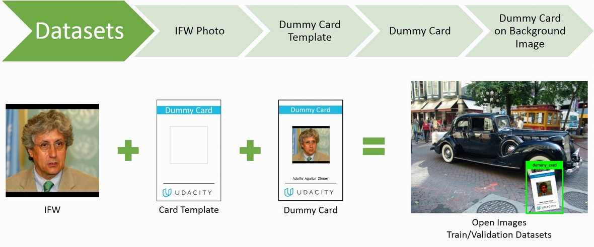

# Machine Learning Engineer Nanodegree
## Capstone Proposal
Pongrut Palarpong 
January 1st, 2018

## Proposal

### Domain Background

In Thailand, person identification methods have been continuing to evolve due to public security issues. The Office of The National Broadcasting and Telecommunications Commission Thailand (NBTC) has launched the new method of registering a new mobile phone SIM card since December 15, 2017. The biometric verification system this new registration method has been used across Thailand in all 55,000 locations which are mobile phone operators’ customer service shops and the networks of the mobile phone operators’ dealers and partners [[1]](#ref).

Under this new method, new SIM card subscribers will have insert their ID cards into the finger print reader or the face recognition card reader at the registration locations. The card readers are connected to the mobile phones or PC of the registration locations. In the case of the face recognition system, the locations will take the SIM card users’ face with the mobile phones embedded with an NBTC registration application. Then the app will see if the captured face matches with the face stored in the ID card database. As expected face recognition method is more popular than fingerprint due to the added cost of card readers at service points, which range from 500 baht ($15) to 9,000 baht ($271) but face recognition is no extra cost, it requires only application installed.  Since the biometric verification system has been launched, there are two main problems with the system.
1. The result of the face recognition that the person in the ID card with the photograph is not matched with sim subscriber's photo, despite the fact the same person.
2. There was a problem that the service points agent used photo from the ID card submitted as current person photo due to difficulty from the first problem.

The capstone project will focus on the demonstration of solution idea for the service points agent used photo from the ID card's submitted as current person photo problem. The object detection technique that which is a part of computer vision will be applied as the main solution.
The concept idea is reducing the shooting time from 2 times to 1 time only, which will force agents to capture the ID card with the current photo of SIM subscriber. However, to add more security step, the object detection to verify that the submitted photo has contain the ID card with photo of sim subscriber.

### Problem Statement

Solution to relieve agent used photo from the ID card submitted as current person photo problem. The system will accept only 1 photo which contain both ID card and current photo to create obstacle for fake photo. The challenge of sending a single image is to locate the ID card and the current photo of the SIM subscriber in the image. Therefore, this project needs to simulate ID card detection by locating the ID card from the image.

Due to privacy restrictions, this project uses a Dummy Card instead of a real ID card. The program will be created to receive an image then accurately locate the Dummy Card. However, it is possible that the agent may put the ID card on the prepared photo and then submit it. This extreme case may be detected by anti-spoofing liveness detection mechanism e.g. eye blinking detection or pupil dilation response, but anti-spoofing liveness detection is not present in scope of this project.

The development pipelines are as follows:
1. Creating 1,030 Dummy Cards by using personal faces from the LFW face dataset [[2]](#ref), and put them on a Dummy Cards.
2. Prepare 1,000 images from the Open Images dataset [[3]](#ref) for use as a background images of train and evaluate datasets.
3. Create 1,000 images dataset for training and evaluating in convolutional neural networks by using 1,000 images of employee's ID cards  and randomly resize,
rotate, adjust image  gamma , and then place randomly on a prepared background.
4. Prepare test dataset by downloading 30 more images of person from google image in order to make it close to real scene photo and then bring the remaining 30 employee's ID cards to randomly placed on the already downloaded image.
5. This step is to label Dummy Card by creating an image annotation of all 1,030 cards on the xml format file.
6. Split 1,000 images dataset to be 900 train dataset, 100 for validation dataset and also another real scene 30 for test dataset.
7. Combine all images & labels and then convert into a single tfrecord file for both train and evaluate datasets.
8. Use the test dataset for training in tensorflow object detection api [[4]](#ref) and evaluate dataset used to evaluate mean average precision (mAP)[[5]](#ref).
9. Convert the trained model into a frozen graph consisting of the model architecture and weights in one file in .pb format.
10. Load the trained model in tensorflow object detection api to test on 30 test dataset to present model performance.

### Datasets and Inputs

This project uses three types of image datasets: 1.) a person's face, 2.) another image without a Dummy Card in the picture, 3.) person portrait images.
1. Creating a Dummy Card requires a human face image to simulate the replacement of an ID card by using a personal face images from the LFW dataset [[2]](#ref).
There are 13,237 total human images from 5,750 individuals and each image size is 250x250 pixels.
The image files will be shuffled then select images of people that contain more than 1 image in the folder. After that, the image will be filtered out image that contain more than one face because the ID card must have only one face. Finally, select only 1,030 first images to be used for Dummy Card creation.
2. The background images will use images from the Open Images Dataset V3 dataset [[3]](#ref), which provides 41,620 image URLs of validation set.
Shuffle and select for 1,000 images from the original URLs with larger than 768 pixels width and height image size, then resize them with width and length of at least 768 pixels which will maintain the original aspect ratio.
3. Personal portrait images will be simulated for real situation testing by using 30 Dummy Card  and the 30 person names to search and download person images that larger than 1024 pixels from the google images, in order to keep the photos in the Dummy Card which will not be too small that they can not be detected in future facial recognition process.

### Solution Statement

The photo was taken by the agent who photographed the photo of SIM subscriber's ID card and reuse it as current SIM subscriber photo.  This problem occurred with the original biometric verification system, the system receives two images, the ID card and the current photo of the SIM subscriber.
The solution of this problem can be prevented by having the agent photograph the current SIM subscriber photo with his/her ID card in a single photo. Using only one image requires an intermediary program for image separation.  Thus, it need to detect two images and send them to the original system in order to split the image,
there are 2 types of objects must be detected: the current photo of SIM subscriber and  ID card photo.

In the first object type need face detection mechanism, dlib Face Detector will be used as a method for detecting faces because of Face Detector dlib can detect the face effectively [[6]](#ref).
The second object type is ID card which will be represented by the Dummy Card  The TensorFlow Object Detection API will be used to detect the location of the Dummy Card of the submitted image. Finally, program will display two faces from the current photo of SIM subscriber and the face from the Dummy Card  The detection precision of Dummy Card will be at 0.8 `mAP@0.5IOU` [[5]](#ref) from the 30 images in test dataset.

### Benchmark Model

This project will use ssd_mobilenet_v1_coco pre-trained detection models[[7]](#ref) as the transfer learning base for the Dummy Card Detection Model.
The performance of ssd_mobilenet_v1_coco is 21 mAP which is the subset of the MSCOCO evaluation protocol. However, the most popular metric uses for evaluating the quality of object detection is Mean Average Precision (mAP) on the protocol of the PASCAL VOC Challenge 2007[[8]](#ref). Therefore, this project benchmark model will base on the PASCAL VOC 2007 metrics and to match the benchmark model fairly with benchmark model.

The benchmark model is Dat Tran's Raccoon detector[[9]](#ref) performance at the best score of 0.8 `mAP@0.5IOU`. The Raccoon detector uses 160 images for training and 40 images for evaluation.  The Dummy Card detector model is expected to score at 0.8 `mAP@0.5IOU` as same as the Raccoon detector but use 900 images for training and 100 images for evaluating.

### Evaluation Metrics

The evaluation of detection task will be judged by the precision/recall curve in which 2 factors are two main parts: the detection are relevant to the object being detected (precision), and the number of detected objects that are relevant (recall).

Precision = [True Positives/(True Positives + False Positives)] 
Recall    = [True Positives/(True Positives + False Negatives)]

True positives: Dummy Card images that the model correctly detected 
False positives: Not Dummy Card images that the model incorrectly detected, classifying them as Dummy Cards. 
False negatives: Dummy Card images that the model did, did not detect as Dummy Cards.

The principal quantitative measure used will be the mean average precision (mAP) of PASCAL VOC 2007 metrics.
Detections are considered True positives and False positives from the area overlapping with predicted bounding boxes BP and ground truth bounding boxes GTB (Intersection Over Union). Intersection Over Union (IOU) is an evaluation metric used to evaluate the accuracy of object detection model. If BP and GTB overlap 100% is the maximum accuracy. However, the `mAP@0.5IOU` is determined that overlap between the predicted bounding box of BP and the ground truth bounding box GTB must exceed 50% the prediction is considered a true positive.  To calculate mean average precision (mAP) metrics by looping overall all ground-truth bounding boxes in the validation dataset.

Figure 1: Illustration of IOU Calculation. Source:[[10]](#ref).

### Project Design

The solution summary of agent photo used from ID card submitted as current person photo problem, the object detection is main part of the algorithm to solve the problem.
Object detection is more challenging than image recognition and classification. Because the objects also need to be localizing by finding the bounding box around it.
However, object detection create opportunities of applying computer vision to solve problems in many fields.

Google released a new object detection API for Tensorflow. The API has been trained on the COCO dataset (Common Objects in Context). 
The dataset contains photos of 90 objects types with a total of 2.5 million labeled instances in 328k images.

Figure 2: Some of the object categories in COCO dataset.

The API provides 12 different models that provide a trade off between speed of execution and the accuracy in placing bounding boxes [[7]](#ref).

The mAP (mean average precision) is the metric evaluation for precision and recall on detecting bounding boxes.
The higher the mAP score, the more accurate of the model is. 
The 3 major CNNs (Convolutional Neural Networks) are  a) Single Shot Multibox Detector (SSD), b) Faster R-CNN (Faster Region-based CNN) and c) R_FCN (Region-Based Fully Convolutional Networks).

**Faster R-CNN** uses a Region Proposal Network (RPN) that shares full-image convolutional features with the detection network, thus enabling nearly cost-free region proposals. An RPN is a fully convolutional network that simultaneously predicts object bounds and objectness scores at each position. The RPN is trained end-to-end to generate high-quality region proposals, which are used by Fast R-CNN for detection [[13]](#ref).

Figure 3: The Faster R-CNN.

  

**R-FCN**, or Region-based Fully Convolutional Net, shares 100% of the computations across every single output. Being fully convolutional, it ran into a unique problem in model design.
each position-sensitive score map represents one relative position of one object class [[11]](#ref). 

Figure 4: The R-FCN.

  

**SSD** (Single-Shot Detector) will differ from the 2 networks described before, by eliminating the proposed generation and regions classification. SSD will reduce the output space of bounding boxes. In prediction time, the network generates scores for the presence of each category object in each default box and produces adjustments to the box to better match the object shape. The network predictions from multiple feature maps with different resolutions to naturally handle objects of various sizes.

Figure 5: The SSD. Source[[11]](#ref)

  
Training SSD is a challenge in every position of the image. It is fed into the conv. blocks in various sizes and aspect raito and then feeds into the fully connected layer.
As a result, the network generates more bounding boxes than any other model, and almost all of them are negative examples. the ratio between the number of background (bg) RoIs
(regions not belonging to any object of interest) and the number of foreground(fg) RoIs could reach as high as 100:1 which may cause imbalance problem.

For this project to use some guideline hard negative mining technique to maintain at least a bg / fg ratio of 3:1 [[14]].(#ref)

Overall, there are 600 distinct classes with a bounding box attached to at least one image. Of these, 545 classes are considered trainable (the intersection of the 600 boxable classes with the 5000 image-level trainable classes).

-----------

### References
[1] Toomgum, S (2017). New SIM registration to require biometric ID starting Dec 15, Retrieved from http://www.nationmultimedia.com/detail/Corporate/30330973/ [Last accessed 14 January 2018]. 
[2] Labeled Faces in the Wild. (2016). Retrieved from http://vis-www.cs.umass.edu/lfw/#resources [Last accessed 14 January 2018]. 
[3] Open Images Dataset V3. (2017). Retrieved from https://github.com/openimages/dataset [Last accessed 14 January 2018]. 
[4] Tensorflow Object Detection API. (2017). Retrieved from https://github.com/tensorflow/models/tree/master/research/object_detection [Last accessed 14 January 2018]. 
[5] Sawtelle, S (2016). Mean Average Precision (MAP) For Recommender Systems, Retrieved from http://sdsawtelle.github.io/blog/output/mean-average-precision-MAP-for-recommender-systems.html [Last accessed 14 January 2018]. 
[6] Muntean, A (2016). Compares face recognition performance of dlib and OpenCV using the WIDER face detection benchmark, Retrieved from https://github.com/andreimuntean/Dlib-vs-OpenCV/ [Last accessed 14 January 2018]. 
[7] Rathod, V (2017). Tensorflow detection model zoo, Retrieved from https://github.com/tensorflow/models/blob/master/research/object_detection/g3doc/detection_model_zoo.md [Last accessed 14 January 2018]. 
[8] PASCAL VOC 2007 metric, Retrieved from https://github.com/tensorflow/models/blob/master/research/object_detection/g3doc/evaluation_protocols.md#open-images [Last accessed 14 January 2018]. 
[9] Tran, D (2017). How to train your own Object Detector with TensorFlow’s Object Detector API,Retrieved from https://towardsdatascience.com/how-to-train-your-own-object-detector-with-tensorflows-object-detector-api-bec72ecfe1d9 [Last accessed 14 January 2018]. 
[10] Barker, J and Gray, A (2016). Exploring the SpaceNet Dataset Using DIGITS, Retrieved from https://devblogs.nvidia.com/parallelforall/exploring-spacenet-dataset-using-digits/ [Last accessed 14 January 2018]. 
[11] Xu, J. (2017). Deep Learning for Object Detection: A Comprehensive Review , Retrieved from https://towardsdatascience.com/deep-learning-for-object-detection-a-comprehensive-review-73930816d8d9  [Last accessed 18 January 2018]. 
[12] Parthasarathy, D (2017). A Brief History of CNNs in Image Segmentation, Retrieved from https://blog.athelas.com/a-brief-history-of-cnns-in-image-segmentation-from-r-cnn-to-mask-r-cnn-34ea83205de4.  [Last accessed 18 January 2018]. 
[13] arXiv:1506.01497 [cs.CV] 
[14] arXiv:1608.02236 [cs.CV] 

[15] [15] LI, Z (2016). Speed/accuracy trade-offs for modern convolutional object detectors , Retrieved from http://joshua881228.webfactional.com/topic_ALL_list/14/ [Last accessed 18 January 2018]. 
**Before submitting your proposal, ask yourself. . .**

- Does the proposal you have written follow a well-organized structure similar to that of the project template?
- Is each section (particularly **Solution Statement** and **Project Design**) written in a clear, concise and specific fashion? Are there any ambiguous terms or phrases that need clarification?
- Would the intended audience of your project be able to understand your proposal?
- Have you properly proofread your proposal to assure there are minimal grammatical and spelling mistakes?
- Are all the resources used for this project correctly cited and referenced?
