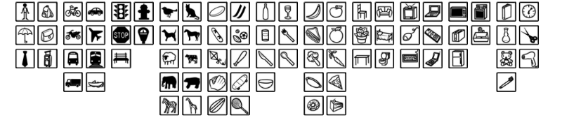
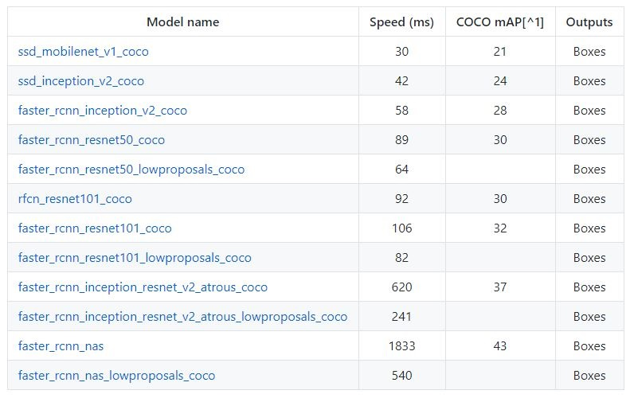
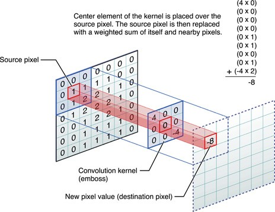

# Machine Learning Engineer Nanodegree
## Capstone Project
Pongrut Palarpong  
February 1, 2018

## I. Definition

### Project Overview
In Thailand, person identification methods have been continuing to evolve due to public security issues. The Office of The National Broadcasting and Telecommunications Commission Thailand (NBTC) has launched the new method of registering a new mobile phone SIM card since December 15, 2017. The biometric verification system this new registration method has been used across Thailand in all 55,000 locations which are mobile phone operators’ customer service shops and the networks of the mobile phone operators’ dealers and partners [1].

Under this new method, new SIM card subscribers will have insert their ID cards into the finger print reader or the face recognition at the registration locations. The card readers are connected to the mobile phones or PC of the registration locations. In the case of the face recognition system, the locations will take the SIM card users’ face with the mobile phones embedded with an NBTC registration application. Then the app will see if the captured face matches with the face stored in the ID card database. As expected face recognition method is more popular than fingerprint due to an added cost of card readers at registration service shops which range from 500 baht ($15) to 9,000 baht ($271). Face recognition is no extra cost, it requires only application installed. Since the biometric verification system has been launched, there are two main problems with the system.

1. Face recognition failure rate of real person with real ID card is still too high.
2. Agent submits fake photo by photograph person photo from ID card.

### Problem Statement
This capstone project aims to solve 2nd problem of  face recognition system which is "agent submits fake photo". The object detection is a technology related to computer vision, it was applied as the key algorithm for resolve the problem. Preventive policy for fake photo problem is  to force agents to submit 1 photo instead of 2 photos. Challenge of receiving a single image is that to locate the ID card and then detect person face in submitted image which requires object detection algorithm to complete this task.

However, ID card is not general object that available in pre-trained models in order to make object detection algorithm able to detect ID card requires retrain the pre-trained models. Due to privacy restrictions, this project trains and detects the Dummy Cards instead of a real ID cards. Developed program is a simulation of person verification step start from receiving submitted image from agents and then locate the Dummy Card and also person face. It is possible that the agent may put the ID card on the prepared photo and then submit it. This extreme case may be detected by anti-spoofing liveness detection mechanism e.g. eye blinking detection or pupil dilation response but anti-spoofing liveness detection is not present in scope of this project.

Dummy Card detection uses the TensorFlow Object Detection API [4] as an object detection framework, it  is an open source framework built on top of TensorFlow that makes it easy to construct, train and deploy object detection models. This framework also provides a pre-trained detection set in the COCO data set, the Kitti dataset, and the Open Images dataset. These models can be useful for out-of-the-box in categories already in COCO (eg, human, automobile, etc.).

### Metrics
The evaluation of detection task will be judged by the precision/recall curve in which 2 factors are two main parts: the detection are relevant to the object being detected (precision), and the number of detected objects that are relevant (recall).

**Precision** = [True Positives/(True Positives + False Positives)] 
   **Recall** = [True Positives/(True Positives + False Negatives)] 

- True positives: Dummy Card images that the model correctly detected
- False positives: Not Dummy Card images that the model incorrectly detected, classifying them as Dummy Cards.
- False negatives: Dummy Card images that the model did not detect as Dummy Cards.

The principal quantitative measure used will be the mean average precision (mAP) of PASCAL VOC 2007 metrics. Detections are considered True positives and False positives from the area overlapping with predicted bounding boxes BP and ground truth bounding boxes GTB (Intersection Over Union). Intersection Over Union (IOU) is an evaluation metric used to evaluate the accuracy of object detection model. If BP and GTB overlap 100% is the maximum accuracy. However, the mAP@0.5IOU is determined that overlap between the predicted bounding box of BP and the ground truth bounding box GTB must exceed 50% the prediction is considered a true positive. To calculate mean average precision (mAP) metrics by looping overall all ground-truth bounding boxes in the validation dataset (Fig.1).

 
Figure 1: Illustration of Intersection Over Union (IOU) Calculation.

## II. Analysis
_(approx. 2-4 pages)_

### Data Exploration
The three types of image datasets were used in project are: a) a person's face, b) background images, c) person portrait images. 
1. Person face images is used for creating dummy cards which uses person face images from the LFW dataset [2]. There are 13,237 total human images from 5,750 unique persons and each image size is 250x250 pixels. The image files was shuffled then select images of persons. The next process is filtered out all images that contain more than one face. Because the ID card must have only one face.  Final process, is to select only 1,093 images to be used as dummy cards (Fig.2). 973 images were used for training process, 100 images for validation the model and 30 for test the model. However, 10 images of 30 test images was photograph from 10 persons with real dummy cards and 20 remaining images used normal dummy card from LFW dataset. 

2. The background images uses the Open Images Dataset V3 dataset [3] which provides 41,620 image URLs of validation set. After shuffled them then select only 1,083 images to be used which 973 training, 100 validating and 10 for difficult images test. The original URLs that have image size larger than 768 pixels width and height. Finally, resized those images with width and length at least 768 pixels which preserved the original aspect ratio (Fig.4).

3. Three sets of test dataset were used for real situation simulation test (Fig.5).
  - Difficult to detect images test, 10 images are difficult to detect in each image, the dummy card is located in various sizes, locations, distortions, color casts, and different translucency.
  - Real background photos test, used 10 dummy cards then downloaded person images that larger than 1024 pixels from the google images.
  - Real photographs test, print 10 dummy cards then take photo of the persons with their dummy cards.

### Exploratory Visualization
In this section, three types of datasets are used for training, validating and testing. The dummy card images is shown in (Fig. 2) but the (Fig. 3-4) is the statistical data and sample images from Open Images dataset. 

 
Figure 2. Visualized sample dummy cards that created from LFW dataset.

Open Images Dataset, there are 600 unique classes with a bounding box attached to at least one image. Of these, 545 classes are considered trainable (the intersection of the 600 boxable classes with the 5000 image-level trainable classes) (Fig. 3) 

 
Figure 3. The classes distribution of boxable validation set.

 
Figure 4. Visualized sample background that created from Open Images dataset.

(Fig. 5) are examples of images used in the Test and Application phase.
 
 
 
Figure 5. Visualized sample test dataset which are a) Difficult to detect images, b) Real background photos test and c) Real photographs test.
### Algorithms and Techniques
The object detection is main solution for fake photo problem. The object detection itself is more challenging than traditional image recognition and classification. The challenge is that not only objects of interest need to be recognized but located by finding the bounding box around it. However, object detection creates opportunities of applying computer vision to solve problems in many real-world problems.

Google released a new object detection API for Tensorflow [4]. The API has been trained on the COCO dataset (Common Objects in Context) object categories shown in (Fig 6.). The API provide 12 pre-trained models with the Object Detection API. They are trained with the COCO dataset and are capable of detecting general objects in 90 categories in (Table 1). 
The COCO mAP column shows the model's accuracy index. Higher numbers indicate better accuracy. As speed increases, accuracy decreases.

 
Figure 6.  Some of the object categories in COCO dataset, it contains photos of 90 objects types with a total of 2.5 million labeled instances in 328k images.

Table 1. Tensorflow 12 different pre-trained models that provide a tradeoff between speed of execution and the accuracy in placing bounding boxes. The mAP (mean average precision) is the metric evaluation for precision and recall on detecting bounding boxes. The higher the mAP score, the more accurate of the model is. The 3 major CNNs (Convolutional Neural Networks) of Object Detection API are a) Single Shot Multibox Detector (SSD), b) Faster R-CNN (Faster Region-based CNN) and c) R_FCN (Region-Based Fully Convolutional Networks).
 

The Convolutional Neural Network (CNN) architectures (Fig. 7) are suitable for image classification because the image is indeed 2D width and height which CNN can effectively do convolution operation by sweeping the relationship between each part of the image and creating important filters (Fig. 8). This convolution operation makes it easy for CNN to detect objects in multiple locations, difference lightings, or even just some part of objects in an image.

 
Figure 7.  Simple ConvNet for image classification could have the simple architecture as [INPUT - CONV - RELU - POOL - FC].

Convolution Layer works as a filter to screen an important feature to classify the class of input image. ReLU is used as an activation function to replace all negative values with 0.

 
Figure 8.  Convolution operation keeps the relationship between pixels in the image by using the filter size n by n pixels sweep all over the image area in order to create the 'Feature Map'.

Max Pooling layers serve to reduce the number of dimensions in each feature map, the most important feature is drawn (Fig. 9). This will allow us to reduce the number of parameters and computations in the network also help to avoid overfitting. 

 
Figure 9. The example of Max Pooling, in the first window the Max Pooling (1,1,5,6) = 6, the next window Max Pooling (2,4,7,8) = 8, the next Max Pooling (3,2,1,2) = 3 and the last Max Pooling (1,0,3,4) = 4.

The traditional CNNs architecture are convolution and max-pooling layers followed by a small number of fully connected layers. Most modern CNNs use a method called Global Average Pooling (GAP) to replace the traditional fully connected layers in CNN (Fig. 10).  The final softmax layer is trained on the target classification which generate output with separate probability for each of target classes.
 
Figure 10. The idea of Global Average Pooling (GAP) is to create feature maps for each of the corresponding categories of classification jobs in the last mlpconv layer. Instead of adding all fully connected layers to the top of the feature map, GAP use the average of each map and outputs pass directly into the softmax activation function that yields the predicted object classes.

Faster R-CNN uses a Region Proposal Network (RPN) that shares full-image convolutional features with the detection network, thus enabling nearly cost-free region proposals. An RPN is a fully convolutional network that simultaneously predicts object bounds and objectness scores at each position (Fig. 11). The RPN is trained end-to-end to generate high-quality region proposals, which are used by Fast R-CNN for detection [13].

 
Figure 11. The Faster R-CNN has two networks: region proposal network (RPN) for generating region proposals and a network using these proposals to detect objects. The main different here with Fast R-CNN is that the later uses selective search to generate region proposals.

R-FCN, or Region-based Fully Convolutional Net, shares 100% of the computations across every single output. Being fully convolutional, it ran into a unique problem in model design. each position-sensitive score map represents one relative position of one object class [11].

 
Figure 12. The R-FCN Key idea of R-FCN for object detection. In this illustration, there are k × k = 3 × 3 position-sensitive score maps generated by a fully convolutional network. For each of the k × k binsin an RoI, pooling is only performed on one of the k 2 maps (marked by different colors).

SSD (Single-Shot Detector) differs from the 2 networks described before (Fig. 13), by eliminating the proposed generation and regions classification [11].

 
Figure 13. SSD will reduce the output space of bounding boxes. In prediction time, the network generates scores for the presence of each category object in each default box and produces adjustments to the box to better match the object shape. The network predictions from multiple feature maps with different resolutions to naturally handle objects of various sizes.

For this project chooses ssd_mobilenet_v1_coco model based on speed [15], since it is highly probable that future liveness detection with video input may be required. The ssd_mobilenet_v1_coco model has fastest speed and acceptable accuracy as shown in (Fig 14.) 

 
Figure14. The accuracy vs time of different configurations.

However, SSD training is a challenge, every position of the image is fed into the conv. blocks in various sizes and aspect ratio and then to the fully connected layer. As a result, the network generates more bounding boxes than any other model, and almost all of them are negative examples. the ratio between the number of background (bg) RoIs (regions not belonging to any object of interest) and the number of foreground(fg) RoIs could reach as high as 100:1 which may cause imbalance problem.

For sd_mobilenet_v1_coco model training (MobileNets), this project will focus on preparing step to train data by selecting a dataset that contains a lot of unique data. The key success of the dataset is the background images from the Open Images Dataset V3 dataset [3]. Since the image of the Dummy Card is 206x324 pixels in order to maintain a bg / fg ratio of about 3: 1 regarding to the guideline of hard negative mining technique [14]. Only background images that larger than 768 pixels from validation will be selected.
The MobileNets is an another class of the convolutional neural network is designed to work on mobile devices, its architecture uses less resources and works faster[16]. MobileNets are built from depthwise separable convolutions used in Inception models [17] to reduce the computation in the first few layers. Depthwise convolution is extremely efficient compare to standard convolution. The standard 3x3 convolutional filters are replaced by two layers which are 3x3 depthwise convolution and 1x1 pointwise convolution to build a depthwise separable filter (Fig. 15).

 
Figure 15. Left: Standard convolutional layer with batchnorm and ReLU. Right: Depthwise Separable convolutions with Depthwise and Pointwise layers followed by batchnorm and ReLU.

### Benchmark
The ssd_mobilenet_v1_coco model [7] is used as the transfer learning base for the Dummy Card Detection Model. The performance of ssd_mobilenet_v1_coco is 21 mAP which used the MSCOCO evaluation protocol. However, the most popular metric uses for object detection evaluation is Mean Average Precision (mAP) on the protocol of the PASCAL VOC Challenge 2007 [8]. Therefore, the benchmark model is based on the PASCAL VOC 2007 metrics. 

The benchmark model is Dat Tran's Raccoon detector [9], the model performance was at 0.8 mAP@0.5IOU. The Raccoon detector useed 160 images for training and 40 images for evaluation. The dummy card detector model is expected to get score at 0.8 mAP@0.5IOU as same as the Raccoon detector but used 900 images for training and 100 images for evaluating.

## III. Methodology
_(approx. 3-5 pages)_

### Data Preprocessing
In this section, all of your preprocessing steps will need to be clearly documented, if any were necessary. From the previous section, any of the abnormalities or characteristics that you identified about the dataset will be addressed and corrected here. Questions to ask yourself when writing this section:
- _If the algorithms chosen require preprocessing steps like feature selection or feature transformations, have they been properly documented?_
- _Based on the **Data Exploration** section, if there were abnormalities or characteristics that needed to be addressed, have they been properly corrected?_
- _If no preprocessing is needed, has it been made clear why?_

### Implementation
In this section, the process for which metrics, algorithms, and techniques that you implemented for the given data will need to be clearly documented. It should be abundantly clear how the implementation was carried out, and discussion should be made regarding any complications that occurred during this process. Questions to ask yourself when writing this section:
- _Is it made clear how the algorithms and techniques were implemented with the given datasets or input data?_
- _Were there any complications with the original metrics or techniques that required changing prior to acquiring a solution?_
- _Was there any part of the coding process (e.g., writing complicated functions) that should be documented?_

### Refinement
In this section, you will need to discuss the process of improvement you made upon the algorithms and techniques you used in your implementation. For example, adjusting parameters for certain models to acquire improved solutions would fall under the refinement category. Your initial and final solutions should be reported, as well as any significant intermediate results as necessary. Questions to ask yourself when writing this section:
- _Has an initial solution been found and clearly reported?_
- _Is the process of improvement clearly documented, such as what techniques were used?_
- _Are intermediate and final solutions clearly reported as the process is improved?_

## IV. Results
_(approx. 2-3 pages)_

### Model Evaluation and Validation
In this section, the final model and any supporting qualities should be evaluated in detail. It should be clear how the final model was derived and why this model was chosen. In addition, some type of analysis should be used to validate the robustness of this model and its solution, such as manipulating the input data or environment to see how the model’s solution is affected (this is called sensitivity analysis). Questions to ask yourself when writing this section:
- _Is the final model reasonable and aligning with solution expectations? Are the final parameters of the model appropriate?_
- _Has the final model been tested with various inputs to evaluate whether the model generalizes well to unseen data?_
- _Is the model robust enough for the problem? Do small perturbations (changes) in training data or the input space greatly affect the results?_
- _Can results found from the model be trusted?_

### Justification
In this section, your model’s final solution and its results should be compared to the benchmark you established earlier in the project using some type of statistical analysis. You should also justify whether these results and the solution are significant enough to have solved the problem posed in the project. Questions to ask yourself when writing this section:
- _Are the final results found stronger than the benchmark result reported earlier?_
- _Have you thoroughly analyzed and discussed the final solution?_
- _Is the final solution significant enough to have solved the problem?_

## V. Conclusion
_(approx. 1-2 pages)_

### Free-Form Visualization
In this section, you will need to provide some form of visualization that emphasizes an important quality about the project. It is much more free-form, but should reasonably support a significant result or characteristic about the problem that you want to discuss. Questions to ask yourself when writing this section:
- _Have you visualized a relevant or important quality about the problem, dataset, input data, or results?_
- _Is the visualization thoroughly analyzed and discussed?_
- _If a plot is provided, are the axes, title, and datum clearly defined?_

### Reflection
In this section, you will summarize the entire end-to-end problem solution and discuss one or two particular aspects of the project you found interesting or difficult. You are expected to reflect on the project as a whole to show that you have a firm understanding of the entire process employed in your work. Questions to ask yourself when writing this section:
- _Have you thoroughly summarized the entire process you used for this project?_
- _Were there any interesting aspects of the project?_
- _Were there any difficult aspects of the project?_
- _Does the final model and solution fit your expectations for the problem, and should it be used in a general setting to solve these types of problems?_

### Improvement
In this section, you will need to provide discussion as to how one aspect of the implementation you designed could be improved. As an example, consider ways your implementation can be made more general, and what would need to be modified. You do not need to make this improvement, but the potential solutions resulting from these changes are considered and compared/contrasted to your current solution. Questions to ask yourself when writing this section:
- _Are there further improvements that could be made on the algorithms or techniques you used in this project?_
- _Were there algorithms or techniques you researched that you did not know how to implement, but would consider using if you knew how?_
- _If you used your final solution as the new benchmark, do you think an even better solution exists?_

-----------

**Before submitting, ask yourself. . .**

- Does the project report you’ve written follow a well-organized structure similar to that of the project template?
- Is each section (particularly **Analysis** and **Methodology**) written in a clear, concise and specific fashion? Are there any ambiguous terms or phrases that need clarification?
- Would the intended audience of your project be able to understand your analysis, methods, and results?
- Have you properly proof-read your project report to assure there are minimal grammatical and spelling mistakes?
- Are all the resources used for this project correctly cited and referenced?
- Is the code that implements your solution easily readable and properly commented?
- Does the code execute without error and produce results similar to those reported?
